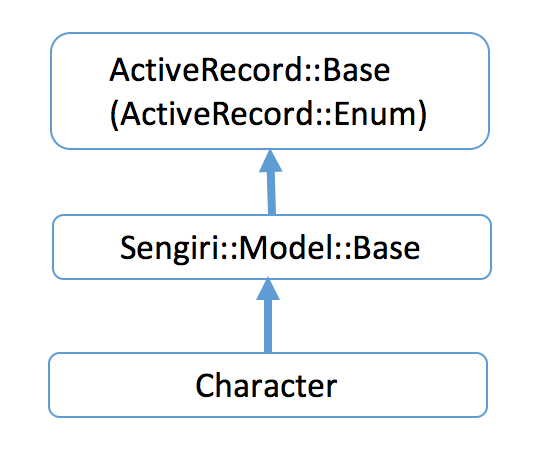
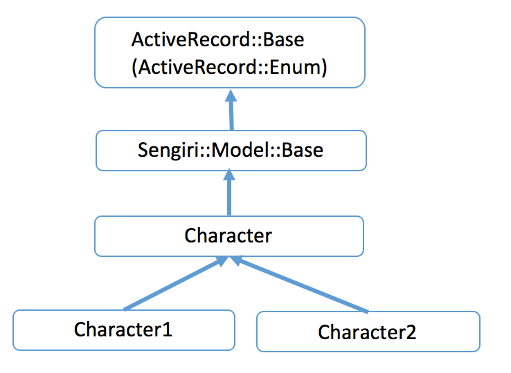
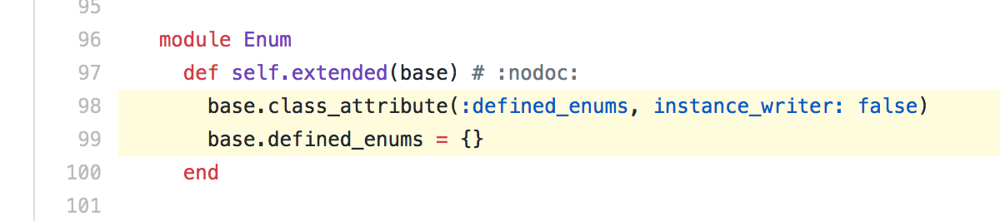
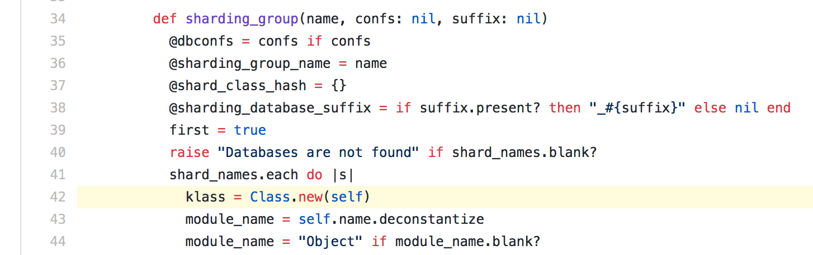
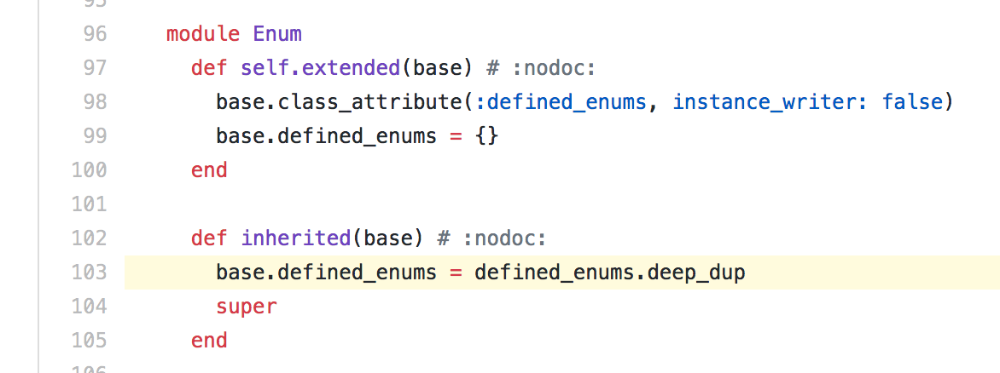

% Rails 5へのアップグレード
% yamotonalds
% 2017-07-31

# 

## 

少し前にRailsを4.2系から5.0系にアップグレードしたときにどんなことをしたか、どんな問題が発生したか、について

##

使ってるgemが対応してなくて5.1系には上げられなかった

(C◯◯P◯◯K◯◯)

##

最低限のgem更新とwarning対応だけ行った


# rails 4.2.8 -> 5.0.4

## rails gemの更新

```
bundle update rails ...
rails app:update
```

## new_framework_defaults.rb

`config/initializers/new_framework_defaults.rb`

Rails 5で挙動が変わったところの互換性を保つための設定。

```
belongs_to_required_by_default
forgery_protection_origin_check
halt_callback_chains_on_return_false
```

今回は全部互換性保った状態

（いつかやらないと…）

## ApplicationRecord

`ActiveRecord::Base` を継承する代わりに `ApplicationRecord` を継承するようにする

ほぼ単純な置換作業

## その他のgemの更新

bundle updateサボってて依存バージョンの制限に引っかからないものがあった

（ `>= 4.2` ってなってるけど5.0には対応してない等）


# 細かい挙動変更に対する修正

## ミリ秒以下の切り捨て

DB的に時刻データのミリ秒以下は保持できない

`reload` すると切り捨てられていたりしたが、モデルの属性に代入した時点でミリ秒以下が切り捨てられるようになった

. . . 

テストで、入れた値を期待したら違う値になる

## error_messagesがnilにならない

バリデーションエラーが無い場合の、属性の `error_messages` が `nil` ではなく `[]` に

## paramsがHashじゃなくなった

params(ActionController::Parameters)はHashを継承しなくなった

`permit` して `to_h` したり `to_unsafe_h` した


## Gemfile内での記述順

今までは↓の順でないと `import` が使えなかった

```ruby
gem 'composite_primary_keys'
gem 'activerecord-import'
```

CPKが、AR-importが拡張した `establish_connection` を上書きしてた

CPK v9.0.5で `establish_connection` を上書きしなくなった

. . .

（今後のバージョンでどうなるかは…）

# composite_primary_keys

## ActiveRecord::AutosaveAssociationでエラー


v8.x(for rails 4.2.x)に入っている autosave_association.rb の内容が、v9.x(for rails 5.0.x)に入っていない（v9.0.7時点）


# i18n

## 文言のテストでコケる

```
◯◯を作成
◯◯ を作成
```

. . .

空白が増えてる

## 調べてみると

`config/locales` に置いてある翻訳がgemでインストールされたlocaleファイルの翻訳で上書かれてた

## 今までのconfig/application.rb

```ruby
I18n.enforce_available_locales = false
I18n.load_path     += Dir[Rails.root.join('config', 'locales', '*.{rb,yml}').to_s]
I18n.default_locale = Settings.backoffice.default_locale
I18n.locale         = Settings.backoffice.locale
```

## 修正後のconfig/application.rb

```ruby
config.i18n.enforce_available_locales = false
config.i18n.load_path     += Dir[Rails.root.join('config', 'locales', '*.{rb,yml}').to_s]
config.i18n.default_locale = Settings.backoffice.default_locale
config.i18n.locale         = Settings.backoffice.locale
```

`config.i18n` を使う


# クラスの動的生成とenum

## ActiveRecord::Enum

↓のように書くと

```ruby
class Character < ActiveRecord::Base
  enum SexType: {
    male:   0,
    female: 1
  }
end
```

↓のように数値ではなく文字列でわかりやすく扱えたり述語メソッドが生えたりする

```ruby
Character.first.SexType  # => "male"
Character.first.male?  # => true
```


## 起こってた問題

Sengiri, MasterWritableが生成した動的クラスで数値が文字列に変換がされない


## クラス定義

```ruby
class Character < Sengiri::Model::Base
  sharding_group :game

  enum SexType: {
    male:   0,
    female: 1
  }

  def foo
    ...
  end
end
```

## 継承関係



## Sengiri::Base.sharding_group




## 起こってた問題

```ruby
Character.first.SexType   # => "male"
Character1.first.SexType  # => 0
```

## 分報窓に書いたら…

👼「知ってますよ」

. . .

ActiveRecord::Enumが使っているclass_attributeの値が動的生成されたクラス側で設定されない状態になる

## class_attribute

copy on writeなクラス変数

class_attributeを持つクラスを継承しても親クラス側で設定されている値は参照できるが、子クラス側で値を変更すると子クラス側だけにそれが反映されて親クラス側の値は変わらない

## class_attributeの例

```ruby
class Base
  class_attribute :setting
end

class Subclass < Base
end

Base.setting = true
Subclass.setting            # => true
Subclass.setting = false
Subclass.setting            # => false
Base.setting                # => true
```

## 何が起こっていたか

```ruby
# 1. モデルクラスは初期状態でenum用class_attributeを持っている
class Character < Sengiri::Model::Base
  # 2. enum定義の前にSengiriが動的にshard用クラスを生成し、
  #    AR::Enumの仕様でenum用class_attributeが空の状態コピーされる
  sharding_group :game

  # 3. enumが定義されてenum用class_attributeに値が設定される
  #    （shard用クラス側は2でcopy on writeされてるので影響しない）
  enum SexType: {
    male:   0,
    female: 1
  }

  def foo
    ...
  end
end
```

## 1




## 2-1



## 2-2



※ ややこしいけど `base` はサブクラス

## もう1度

```ruby
# 1. モデルクラスは初期状態でenum用class_attributeを持っている
class Character < Sengiri::Model::Base
  # 2. enum定義の前にSengiriが動的にshard用クラスを生成し、
  #    AR::Enumの仕様でenum用class_attributeが空の状態コピーされる
  sharding_group :game

  # 3. enumが定義されてenum用class_attributeに値が設定される
  #    （shard用クラス側は2でcopy on writeされてるので影響しない）
  enum SexType: {
    male:   0,
    female: 1
  }

  def foo
    ...
  end
end
```

## どうやって解決したか

`sharding_group` を `enum` より後に書けば問題は起きないが、細かい宣言順を意識したくなかった

shardクラス側にも同じenumを定義した

```ruby
module Sengiri::Enum
  def enum(definitions)
    super
    shard_classes.each do |klass|
      klass.public_send(:enum, definitions.merge(_suffix: "#{definitions[:_suffix]}#{klass.shard_name}"))
    end
  end
end
```

※ `_suffix` は同名scope定義の警告回避


## MasterWritableでも同じ問題が発生

Master-Slave構成のDBのMasterを参照するためのmodule

includeすると動的にWritableクラスを生成する

```ruby
class Foo < ApplicationRecord
  include MasterWritable  # Foo::Writableクラスが生成される
end
```

. . .

Sengiriの場合とほぼ同じ方法で解決


## 

これでSengiriやMasterWritableを使っていてもenumが文字列を返すようになった

## translation missing

数値 → 文字列 の影響でi18nのtranslation missingが発生

テストで 「translation missing: ...」同士を比較して通ってしまう

. . .

⇒ テストではtranslation missingで例外を投げる

. . .

```ruby
config.action_view.raise_on_missing_translations = true
```

`I18n.t` の直接呼び出しには効果がなかったので `I18n.exception_handler` を設定


# 感想

##

- Rails 5にアップグレードできてうれしかった
    - 5.1にも早くしたい
- CPKを避けたい気持ちが高まった
- gemのバージョンアップはこまめにしよう
- class_attributeと動的クラス生成は注意しよう


